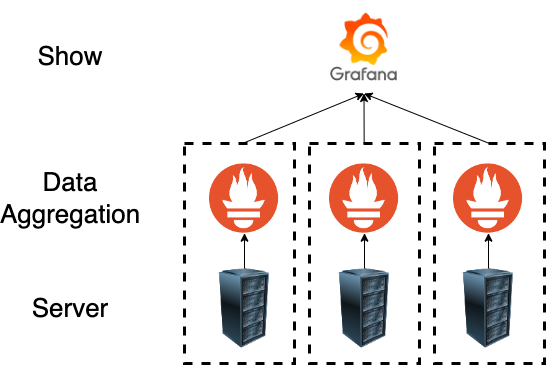

# multi-server-resource-management
Using Prometheus to collect server resource data and displaying it with Grafana. The modules responsible for sending data include node_exporter, cadvisor, and nvidia_gpu_exporter.

## Structure
- grafana
- prometheus

## Doucument

[document](https://skysora.github.io/post/4/)
